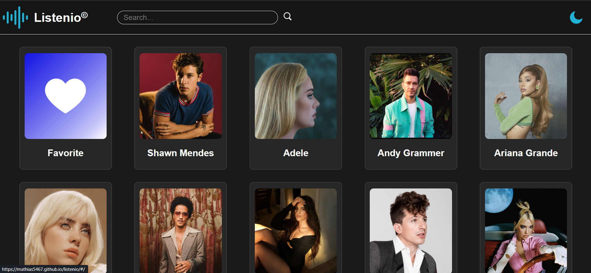
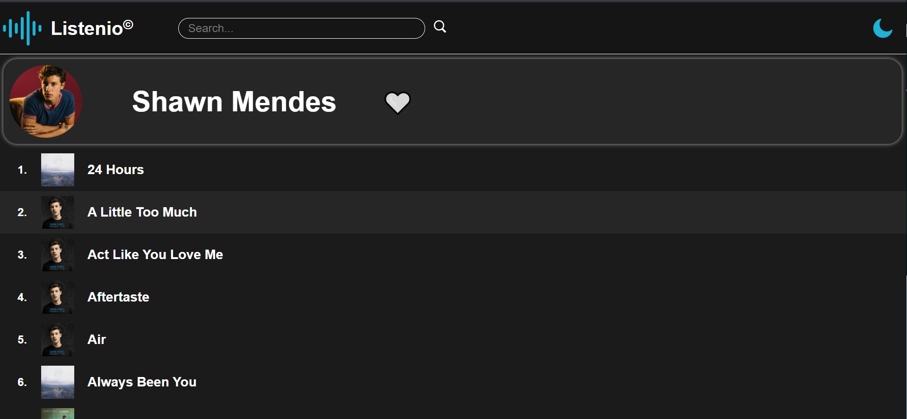

# Listenio 🎧

**Listenio** is a Spotify-like app where users can **search interprets (artists)** and **add them to favorites**.

## Features
- 🔎 Search interprets by name
- 🧡 Add interpret to favorites
- ❌ Remove interpret from favorites
- 📌 View all favorite interprets in one list

## How it works
1. Search for an interpret
2. Choose one from the results
3. Click **🧡**
4. Find them later in **Favorites**

